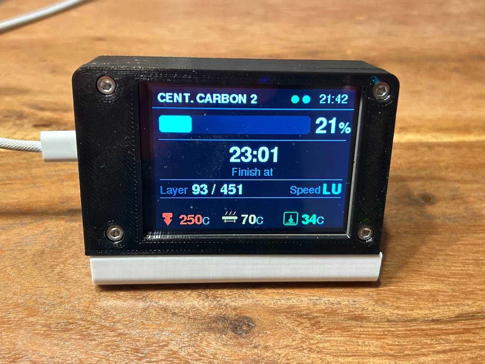
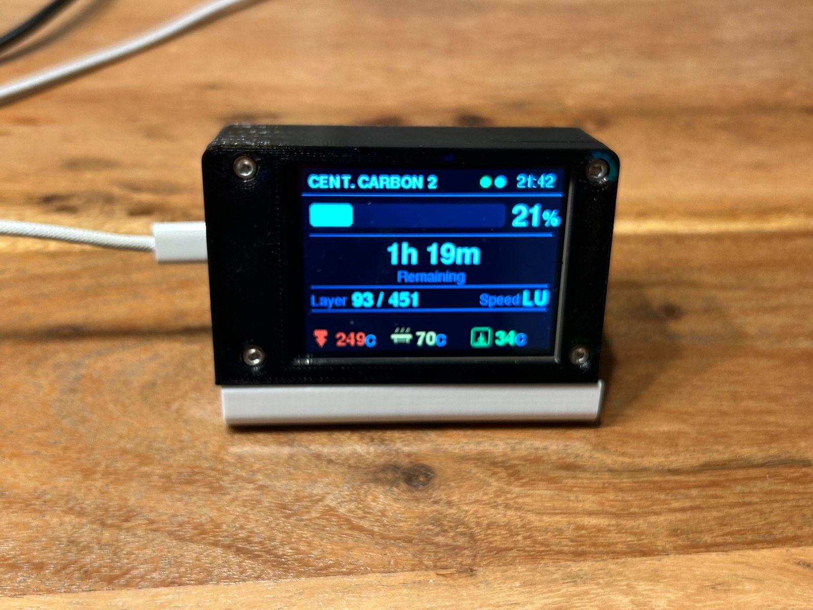
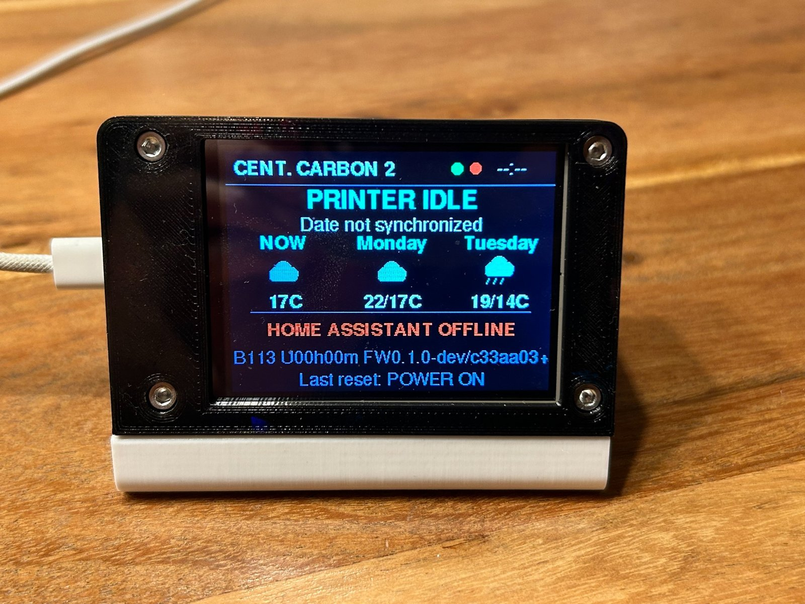
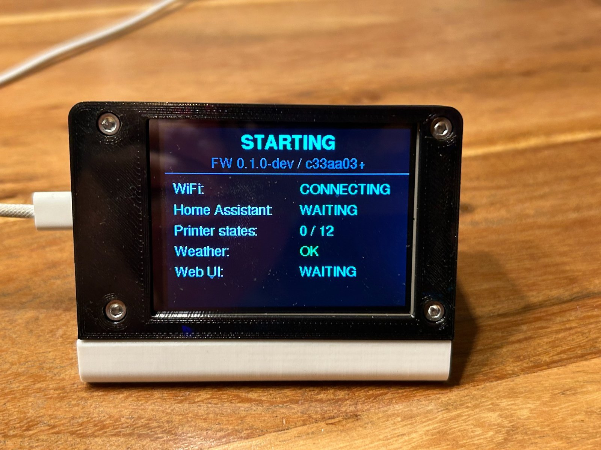
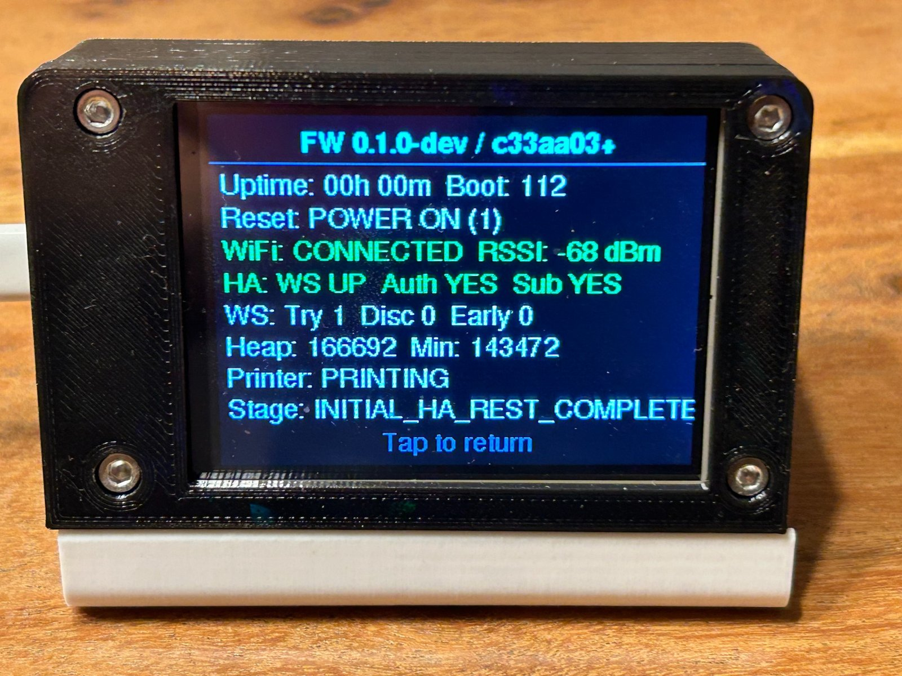

# ESP32-C3 Elegoo Centauri Carbon 2 Monitor

An Arduino-based external 320×240 TFT monitor for the Elegoo Centauri Carbon 2, powered by an ESP32-C3. Printer data comes from Home Assistant: an asynchronous REST task loads initial values, while authoritative live updates arrive through a printer-only `subscribe_trigger` WebSocket subscription.

The monitor presents a dedicated printing view, pause and completion views, and an idle dashboard with current weather and a two-day forecast. A local Web UI handles Home Assistant settings, status information, maintenance, and diagnostics. WiFiManager provides WiFi-only captive-portal provisioning when stored credentials are missing or cannot connect during startup.

> Home Assistant and the required Centauri Carbon 2 entities are prerequisites. The monitor does not communicate with the printer directly.

<p align="center">
  
</p>

## ✨ Features

- Live printer data from Home Assistant over a targeted WebSocket `subscribe_trigger`
- Deferred, asynchronous initial printer-state loading through the Home Assistant REST API
- Printing screen with progress, remaining time/calculated ETA, layers, nozzle/bed/chamber temperatures, and print-speed mode/value
- Explicit printer state machine for idle, printing, paused, and completed prints
- Preheating treated as active and pausing/paused shown on a dedicated pause screen
- Successful completion screen with completion time and last valid layer information, displayed for 60 seconds
- Cancellation through explicit `stopped` status rather than progress-based inference
- Idle dashboard with long date, HA status, boot/uptime diagnostics, current weather, and forecasts for the next two days
- Weather icons drawn with Adafruit GFX primitives—no bitmap assets or Unicode weather glyphs
- Persistent, versioned JSON application configuration in LittleFS
- WiFiManager captive portal for initial WiFi setup and deliberate credential recovery
- Optional persistent WiFi transmit-power limit for compatibility testing
- Persistent Web UI-driven resistive-touch calibration with no source changes or recompilation
- Read-only touch-accessible TFT diagnostics with tap-to-close and a 20-second timeout
- Lightweight local Web UI with Status, Configuration, Diagnostics, and Maintenance sections
- Automatic WiFi recovery and HA reconnect, authentication, and resubscription
- Recovery from repeated early WebSocket disconnects by reconstructing the client after three consecutive failures
- Serial diagnostics, boot counter, reset reason, heap statistics, and bounded temporary StateTrace logging
- Firmware version, base Git revision, dirty-build marker, and compiler build timestamp
- Dirty-region display updates to avoid periodic full-screen flicker

## 📷 User interface and screenshots

### Printing status

The printing view shows current progress and percentage, estimated finish time or remaining print time, current and total layer, the configured print-speed mode, and nozzle, bed, and chamber temperatures. The central time field alternates between relevant information such as finish time and remaining time.

<p align="center">
  
</p>

### Remaining print time

The alternate printing view keeps the same live print details while presenting the estimated remaining duration.

<p align="center">
  
</p>

### Idle and weather

When the printer is idle, the display shows current weather and a two-day forecast. Home Assistant connection or error information remains visible where applicable, alongside the existing device diagnostics.

<p align="center">
  
</p>

### Startup status

The dedicated startup screen reports WiFi and Home Assistant status, initial printer-state loading progress, weather initialization, and Web UI readiness. This makes startup progress and failures visible without requiring a USB serial console.

<p align="center">
  
</p>

### On-device diagnostics

The read-only touch-accessible diagnostics view shows the firmware version and Git revision, uptime, boot count, reset reason, WiFi state and RSSI, Home Assistant WebSocket/authentication/subscription state and statistics, heap information, resolved printer state, and the current or last boot stage.

<p align="center">
  
</p>

## 🔌 Hardware and wiring

The sketch targets an ESP32-C3 connected to an ILI9341 320×240 TFT in landscape orientation. The source identifies the original controller as an ESP32-C3 SuperMini, while Arduino IDE builds use the generic **ESP32C3 Dev Module** profile.

| ILI9341 signal | ESP32-C3 pin | Source constant | Notes |
|---|---:|---|---|
| SCK / CLK | GPIO 4 | `TFT_SCK` | SPI clock |
| MOSI / SDI | GPIO 6 | `TFT_MOSI` | ESP32-C3 to display data |
| CS | GPIO 7 | `TFT_CS` | Display chip select |
| DC / RS | GPIO 3 | `TFT_DC` | Data/command select |
| RST | GPIO 1 | `TFT_RST` | Display reset |
| MISO / SDO | GPIO 5 | `TFT_MISO` | Shared SPI MISO for the touch controller; the TFT does not use it |

The firmware uses the ESP32-C3 `FSPI` peripheral and TFT rotation `3`. Power, ground, and backlight wiring are not defined in the source; follow the electrical requirements of your specific modules.

### Resistive touch controller

The firmware supports an XPT2046-compatible resistive touch controller using non-blocking polling on the TFT's shared SPI bus. A calibrated tap on a normal display opens the read-only on-device diagnostics screen. Tapping diagnostics returns to the previous display, and the page also closes automatically after 20 seconds without touch. Touch does not expose printer controls, pause/resume/cancel actions, or destructive maintenance actions.

| Touch signal | ESP32-C3 pin | Notes |
|---|---:|---|
| T_CLK | GPIO 4 | Shared with TFT SCK |
| T_DIN | GPIO 6 | Shared with TFT MOSI |
| T_DO | GPIO 5 | Shared SPI MISO |
| T_CS | GPIO 10 | Dedicated touch chip select |
| T_IRQ | Not connected | Touch uses non-blocking polling |

The TFT and XPT2046 use separate active-low chip-select lines. Touch transactions run at 2 MHz through the installed `XPT2046_Touchscreen` library.

Touch calibration is started from the Web UI Diagnostics page using **Calibrate Touch** or **Recalibrate Touch**. The TFT guides the user through four corner targets and derives the raw ranges, axis orientation, and inversion settings. A new calibration is saved only after validation succeeds; a failed or cancelled attempt preserves the previous valid calibration. Calibration values are stored in the existing versioned LittleFS configuration and persist across reboot, so calibration requires neither source editing nor recompilation.

## 3D-printed enclosure

The enclosure is 3D printed and adapted specifically for this project's ESP32-C3 and ILI9341 implementation. The original design by DorffMeister ([@DorffMeister_7295](https://www.printables.com/@DorffMeister_7295)) already includes the desktop stand/platform. This project modifies only the front bezel so it better hides the rough or uneven edges of the ILI9341 module, adds a USB cut-out, and adds an ESP32-C3 mounting solution.

- [Original Printables model: Case for 2.8 ILI9341 TFT LCD and Microcontroller](https://www.printables.com/model/441958-case-for-28-ili9341-tft-lcd-and-microcontroller)
- [Project remix: Case for 2.8 ILI9341 TFT LCD and ESP32-C3](https://www.printables.com/model/1822402-case-for-28-ili9341-tft-lcd-and-esp32-c3)
- [Download the included STL files and read the enclosure notes](hardware/enclosure/)

The enclosure STL files are distributed under [CC BY-NC 4.0](https://creativecommons.org/licenses/by-nc/4.0/). This license applies to the enclosure files and does not replace the software license of this project.

## Software requirements

| Dependency | Purpose | Repository evidence for version |
|---|---|---|
| ESP32 Arduino core | ESP32-C3, WiFi, HTTP, SPI, Preferences, LittleFS, mDNS, FreeRTOS, and diagnostics | Not pinned |
| Adafruit GFX Library | Text and primitive graphics | Not pinned |
| Adafruit ILI9341 | TFT driver | Not pinned |
| ArduinoJson | REST, WebSocket, weather, and configuration JSON | Not pinned |
| ArduinoWebsockets | Home Assistant WebSocket client | Not pinned |
| WiFiManager | WiFi provisioning and credential reset | 2.0.17, or a compatible ESP32-capable release |
| XPT2046_Touchscreen | Resistive touch polling and raw samples | 1.4, or a compatible release |

The GFX fonts used by the sketch are supplied by Adafruit GFX. PlatformIO is not used.

## 🛠️ Arduino IDE configuration

Open `ESP32_C3_ILI9341_Elegoo_Monitor.ino` directly in Arduino IDE and select:

| Setting | Required value |
|---|---|
| Board | **ESP32C3 Dev Module** |
| Flash Size | **4 MB (32 Mb)** |
| Partition Scheme | **Huge APP (3MB No OTA/1MB SPIFFS)** |
| USB CDC On Boot | **Disabled** |

The firmware is larger than the default ESP32-C3 application partition, so Huge APP is required. It provides approximately 3 MB for the application and retains an approximately 1 MB filesystem partition used through LittleFS for configuration and StateTrace diagnostics.

Huge APP has no OTA slot. Upload firmware through the normal Arduino IDE USB/serial workflow. Although the menu labels the filesystem partition “SPIFFS,” the application mounts it with `LittleFS`.

### USB CDC and Serial diagnostics

**USB CDC On Boot: Disabled** is the hardware-tested configuration for this project. Ten consecutive normal hardware boot tests completed successfully with reliable WiFi and Home Assistant connections, without requiring UniFi AP locking.

Enabling USB CDC On Boot maps `Serial` to HWCDC/native USB on the ESP32-C3, making project Serial output available in Arduino IDE Serial Monitor through the native USB connection. CDC-enabled builds showed unreliable normal startup and network behavior in testing when the device was attached to a PC USB host. With CDC disabled, normal standalone boots were reliable and project Serial logging uses UART0; project Serial output is therefore not available in Arduino IDE Serial Monitor through the native USB connection. The ESP32-C3 ROM may still emit limited boot information through the USB path, so disabling CDC does not imply that every form of USB output disappears.

For Arduino CLI, select the disabled setting explicitly with `CDCOnBoot=default`—the option name used by ESP32 Arduino core 3.3.11 for the menu value **Disabled**. The alternative `CDCOnBoot=cdc` selects **Enabled**. The canonical build FQBN is:

```text
esp32:esp32:esp32c3:CDCOnBoot=default,FlashSize=4M,PartitionScheme=huge_app
```

## Home Assistant requirements

Printer entities are provided by [danielcherubini/elegoo-homeassistant](https://github.com/danielcherubini/elegoo-homeassistant). This monitor consumes the Home Assistant entities created by that integration and does not communicate directly with the printer.

The configurable printer entity prefix adapts the monitor to the object ID assigned by Home Assistant. Its default is `centauri_carbon_2`, producing IDs such as `sensor.centauri_carbon_2_druckstatus`. Enter only the object-ID prefix, without the `sensor.` domain or suffix. Valid prefixes contain lowercase letters, digits, and underscores.

The following suffixes are fixed and combined with `sensor.<configured-prefix>`:

| Purpose | Fixed suffix |
|---|---|
| Remaining print time | `_remaining_print_time` |
| Total layers | `_total_layers` |
| Current layer | `_current_layer` |
| Percent complete | `_percent_complete` |
| Generic current status | `_aktueller_status` |
| Authoritative print status | `_druckstatus` |
| Print error | `_druckfehler` |
| Error reason | `_fehlerstatusgrund` |
| Chamber/box temperature | `_box_temp` |
| Nozzle temperature | `_nozzle_temperature` |
| Bed temperature | `_bed_temperature` |
| Print speed | `_print_speed` |

An empty or invalid printer prefix safely disables printer REST/WebSocket communication while leaving WiFi, weather, and the Web UI available.

Weather can use any compatible Home Assistant `weather.*` entity that supports the forecast service response required by `weather.get_forecasts`. Development and testing used [FL550/dwd_weather](https://github.com/FL550/dwd_weather), but that integration is optional. The weather entity is configured through the Web UI and defaults to empty for new installations; empty disables weather retrieval without affecting printer monitoring.

### Long-Lived Access Token

A Home Assistant Long-Lived Access Token (LLAT) is required for authenticated REST and WebSocket access. Create one in Home Assistant and enter it on the monitor's Web UI Configuration page.

The Web UI never displays the stored token back in plaintext. The password field is intentionally empty: submitting it empty preserves the current token, while a non-empty value replaces it.

## First-time setup

1. Install the board package and required libraries.
2. Select the required Arduino IDE settings above.
3. Optional: Run `powershell -ExecutionPolicy Bypass -File tools/build_prep.ps1` from the project root before compiling to include the current Git revision in the firmware identifier. The firmware also builds without this step.
4. Compile and upload `ESP32_C3_ILI9341_Elegoo_Monitor.ino`.
5. The ESP32-C3 first attempts to use WiFi credentials already stored by its WiFi subsystem.
6. If startup connection fails, join **Elegoo-Monitor-Setup** and use its WiFi-only captive portal.
7. Open the Web UI using the IP printed over Serial or the default `http://cc2-monitor.local/`. If the name was previously changed, use the configured mDNS name.
8. In **Configuration**, enter the HA host/IP, port, LLAT, POSIX timezone, printer entity prefix, and optional weather entity.
9. Save, restart as instructed, then use **Status** to verify printer data, authentication, subscription, and weather.
10. Open **Diagnostics** and select **Calibrate Touch** to perform the guided TFT calibration when needed.

The Web UI remains independent of Home Assistant availability once WiFi is connected.

During startup, the TFT progress screen reports WiFi, Home Assistant, initial printer-state loading, weather initialization, and Web UI readiness. Initial printer REST loading is deferred until WiFi and the bounded HA startup grace period are ready, then runs asynchronously so it does not hold up the normal startup path. Repeated REST transport failures cause the initial load to fail fast rather than retrying every entity, while WebSocket updates remain authoritative for live printer state.

## Web UI

The lightweight HTTP server listens on port 80 and publishes an mDNS HTTP service using the configured device name.

### Status

- firmware identifier, clean/dirty state, and compiler build date/time
- WiFi state and ESP IP
- HA WebSocket, authentication, and subscription state
- printer entity prefix and whether its configuration is valid
- resolved printer state and both raw status values
- weather status
- StateTrace logging state
- boot count, uptime, reset reason, free heap, and minimum free heap

### Configuration

- device/mDNS name
- WiFi transmit-power limit, or Default to retain the ESP32 core setting
- HA host/IP, port, and LLAT
- POSIX timezone
- printer entity prefix
- weather entity and refresh interval
- ETA/remaining-time switch interval
- StateTrace logging enabled/disabled

Configuration is stored as versioned JSON in `/config.json` on LittleFS. Saved changes take effect after restart. Weather refresh values outside 1 minute–24 hours and ETA switch values outside 1–60 seconds fall back to compiled defaults.

### Diagnostics

- firmware/build metadata, device uptime, boot count, reset reason, heap, and loop timing
- current and previous persisted BootStage information
- touch initialization, calibration validity, raw ranges, axis orientation, and inversion
- **Calibrate Touch** or **Recalibrate Touch**, plus cancellation that preserves the previous valid calibration
- WiFi connection details, RSSI, and configured/effective transmit power
- Home Assistant WebSocket/authentication/subscription state and connection counters
- printer raw/resolved state, events, weather, and temporary StateTrace information

### WiFi transmit power

The Configuration page can optionally limit WiFi transmit power to one of the values supported by
the installed ESP32 Arduino core. **Default** leaves transmit power entirely under control of the
ESP32/Arduino core and does not call `WiFi.setTxPower()`.

A reduced transmit-power limit can improve compatibility in some ESP32/access-point combinations.
The project encountered such an issue with a UniFi access point, but this does not mean that UniFi
installations generally require reduced transmit power. **8.5 dBm** is the hardware-tested
compatibility value for this project. The setting persists in LittleFS and changing it requires a
device restart.

### Maintenance

- restart the device
- clear application configuration and restart with compiled defaults
- reset stored WiFi credentials after a confirmation page without clearing application configuration
- show, download, and confirm clearing of the temporary StateTrace log

Clearing application configuration and resetting WiFi credentials are separate operations.

## Printer state handling

The authoritative source is `sensor.<configured-prefix>_druckstatus`:

| Normalized HA value | Monitor behavior |
|---|---|
| `idle` | Idle before a print; intentionally ignored while an active print is established |
| `preheating` | Active printing view |
| `printing` | Printing view |
| `pausing`, `paused` | Paused view |
| `stopping` | Preserve active state while waiting for an explicit terminal value |
| `stopped` | Explicit cancellation; return directly to idle |
| `complete` | Explicit success; show PRINT COMPLETE for 60 seconds when eligibility checks pass |
| `unavailable` | Preserve the current resolved state |

Real purge and color-change sequences can report transient `idle`, so it is ignored during an established active job. Completion is never inferred from progress reaching 100%.

HA may replace `complete` or `stopped` with `idle` before the main loop runs. Terminal events are therefore latched on arrival and consumed in event order. A later `stopped` overrides an earlier pending completion. The completion view snapshots the last valid current and total layers; invalid later values do not erase the snapshot, and missing totals are not inferred.

## Reliability and recovery

- Initial REST loading is deferred and asynchronous, uses finite timeouts, and fails fast after repeated transport failures; malformed responses or unavailable HA services do not reboot the ESP32-C3.
- Live updates use a printer-only WebSocket subscription rather than a broad event stream.
- WebSocket updates remain authoritative when asynchronous initial REST results arrive later.
- Disconnects trigger reconnect, reauthentication, and resubscription with backoff capped at 30 seconds.
- Repeated connections that close before authentication and subscription receive exponential backoff. After three consecutive early disconnects, the stale WebSocket client is reconstructed before retrying.
- Temporary `idle` and `unavailable` values preserve an established active print state.
- Runtime WiFi loss uses `WiFi.reconnect()` on a five-second retry interval rather than immediately starting an AP.
- An optional configured WiFi transmit-power limit is applied after STA mode starts and before WiFiManager connects; Default leaves the core value unchanged.
- Weather uses separate short-timeout HTTP work and the Web UI remains independent of HA availability.

## Diagnostics and StateTrace

Serial diagnostics use 115200 baud and include boot/reset information, printer state, WiFi/WebSocket/authentication/subscription state, connection and event counters, uptime, free heap, and minimum free heap. With the required USB CDC On Boot setting disabled, project Serial logging uses UART0 rather than the ESP32-C3 native USB CDC interface. The idle display shows boot count, uptime, reset reason, and a compact firmware ID.

A calibrated tap on the normal TFT view opens a read-only diagnostics page showing firmware/Git identification, uptime, boot count, reset reason, WiFi state and RSSI, Home Assistant WebSocket/authentication/subscription state, connection counters, current/minimum heap, resolved printer state, and BootStage information. Tap again to return to the previous normal view, or wait 20 seconds for automatic return. Printer and network processing continues while this page is displayed.

Temporary `StateTrace` logging uses `/state_trace.log` in LittleFS. It records boot/reset, both raw status changes, resolved transitions, printer error/reason changes, WebSocket lifecycle and recovery, ignored active idle, and terminal-signal latching/consumption. It does not intentionally record credentials.

StateTrace logging is enabled by default for the current development firmware and can be enabled or disabled on the Web UI Configuration page. Disabling it stops new writes without deleting the existing file; size, download, and clear actions remain available. Re-enabling resumes normal bounded logging. Serial diagnostics are unaffected.

Lines use synchronized local time when available, otherwise `UPTIME_MS=<value>`. The file is bounded to approximately 64 KiB; when the next write would exceed the limit, the old file is removed and logging restarts. Logging failure is non-fatal.

Use **Maintenance → Temporary state trace diagnostics** to see its size, download `state_trace.log`, or clear it after confirmation. The server exposes only this fixed trace path, not arbitrary filesystem files.

## Development

The original project idea, requirements, hardware setup, hardware testing, and design decisions came from SVLoneStar. ChatGPT was used for software architecture, feature design, debugging strategy, code review, and coordination of implementation work. OpenAI Codex worked directly on the repository to implement and refactor code, compile builds, perform repository checks, and verify changes.

Development followed an iterative cycle: Idea → architecture → implementation → compile → flash → hardware test → diagnostics → refinement. The resulting project is maintained and hardware-tested by SVLoneStar. The firmware reflects this collaborative process rather than being independently authored entirely by either the human or AI participants.

## Project structure

| Module | Responsibility |
|---|---|
| `ESP32_C3_ILI9341_Elegoo_Monitor.ino` | Setup, initialization, and main loop |
| `AppState.h/.cpp` | Shared objects, cached entity IDs, pins, data, counters, timers, and dirty flags |
| `Config.h/.cpp` | Configuration structure, version, validation, and defaults |
| `ConfigStore.h/.cpp` | LittleFS JSON load/save/clear |
| `Diagnostics.h/.cpp` | Boot counter, reset reason, uptime, and Serial diagnostics |
| `Display.h/.cpp` | General TFT layouts and dirty-region rendering |
| `BootStage.h/.cpp` | Persisted startup-stage tracking and startup timing diagnostics |
| `HomeAssistant.h/.cpp` | Asynchronous printer REST load, WiFi provisioning/recovery, WebSocket authentication/subscription/recovery |
| `PrinterData.h/.cpp` | Entity parsing, state machine, terminal latching, layer snapshots, and formatting |
| `StateTrace.h/.cpp` | Bounded temporary LittleFS trace |
| `TimeHelpers.h/.cpp` | NTP, timezone, clock, and date |
| `TouchInput.h/.cpp` | Resistive touch polling, persistent calibration, coordinate mapping, and TFT diagnostics navigation |
| `Weather.h/.cpp` | Weather REST task, forecast cache, primitive icons, and weather-specific drawing |
| `WebUI.h/.cpp` | HTTP status/configuration/maintenance UI, mDNS, and trace download |
| `Version.h` | Manual semantic version, generated-metadata fallback, and identifier macros |
| `tools/build_prep.ps1` | Generates ignored Git revision, dirty state, and branch metadata before builds |

## Known limitations

- Home Assistant and compatible entities from the Elegoo integration are required; there is no direct printer connection.
- Huge APP has no OTA slot, so firmware upload is USB/serial only.
- Arduino IDE has no reliable project-local pre-build hook for generating Git metadata. Run `tools/build_prep.ps1` manually if Git revision metadata is desired; it is not required to compile the firmware. Without `GeneratedVersion.h`, the existing fallback in `Version.h` is used.
- Development/debugging only: closing Arduino IDE can cause an ESP32-C3 reset reported by firmware diagnostics as `USB (11)` with either USB CDC setting. After this IDE-induced reset, a CDC-enabled build may hang. With the canonical CDC-disabled build, the device boots and connects to WiFi, but the Home Assistant connection may fail. This accepted development-environment edge case is not representative of normal standalone runtime behavior.
- Printer entity suffixes are fixed; the shared printer prefix and weather entity are configurable.
- HA traffic uses unencrypted `http://` and `ws://`; deploy only on a trusted network unless transport security is added.
- Touch interaction is intentionally limited to calibration and the read-only TFT diagnostics page; gestures and printer-control actions are not implemented.
- StateTrace is temporary and restarts instead of rotating when its size limit is reached.

## Possible future work

These are ideas, not implemented features:

- individually configurable printer entity suffixes if future integrations require them
- secure HA transport where supported

## 🔐 Security

- Never commit WiFi credentials or a Home Assistant LLAT to Git.
- Treat local configuration exports, backups, downloaded device data, and configuration screenshots as sensitive.
- The LLAT field loads blank; leaving it blank preserves the stored value.
- Rotate a token immediately if exposed in source, logs, screenshots, or repository history.
- Perform a repository-history secret audit before any public release; deleting a secret from the current source does not remove it from existing commits.
- Keep the unauthenticated local Web UI on a trusted network.

## License

This project is licensed under the [MIT License](LICENSE). The Home Assistant integrations and Arduino libraries it consumes remain subject to their own licenses.
